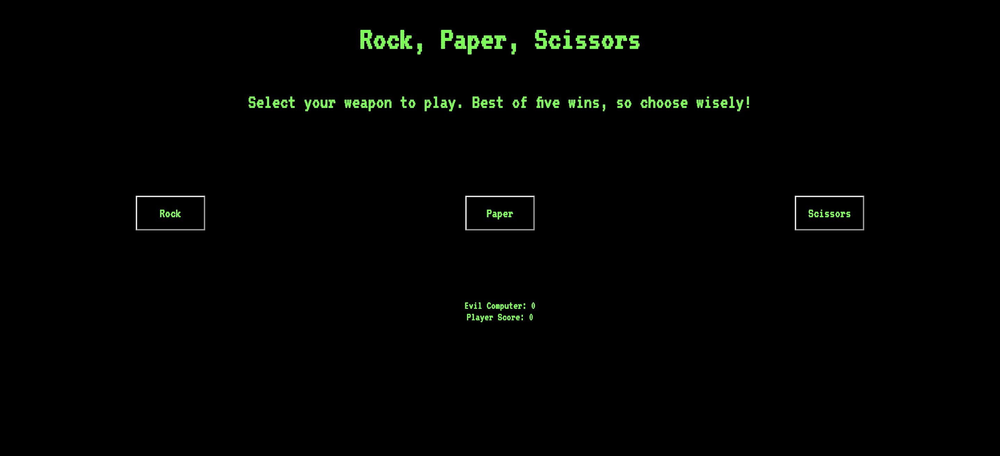

# Rock, Paper, Scissors: Man VS Machine

Rock, Paper, Scissors is a JavaScript website project that allows users to play a five round game of rock, paper, scissors. This project was based on the Rock, Paper, Scissors assignment from The Odin Project.

## Description

On the page, simply click the button of your selected weapon. The program will determine a winner of the round, and update the score. After five rounds, the game will determine an overall winner.

## Image

## Live

https://hearn-dev.github.io/rock_paper_scissors/